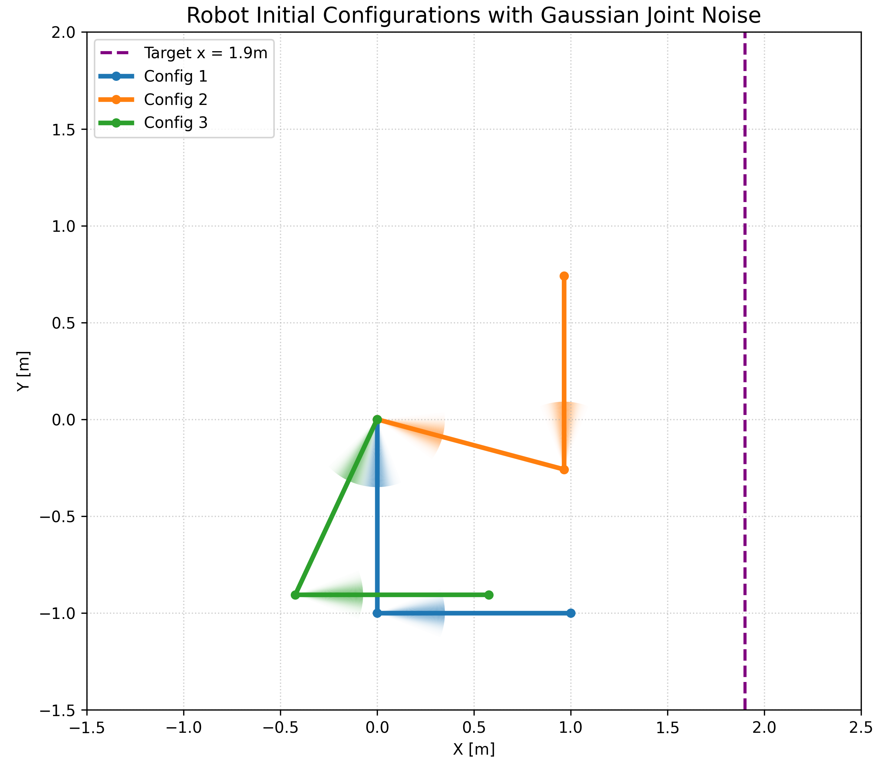
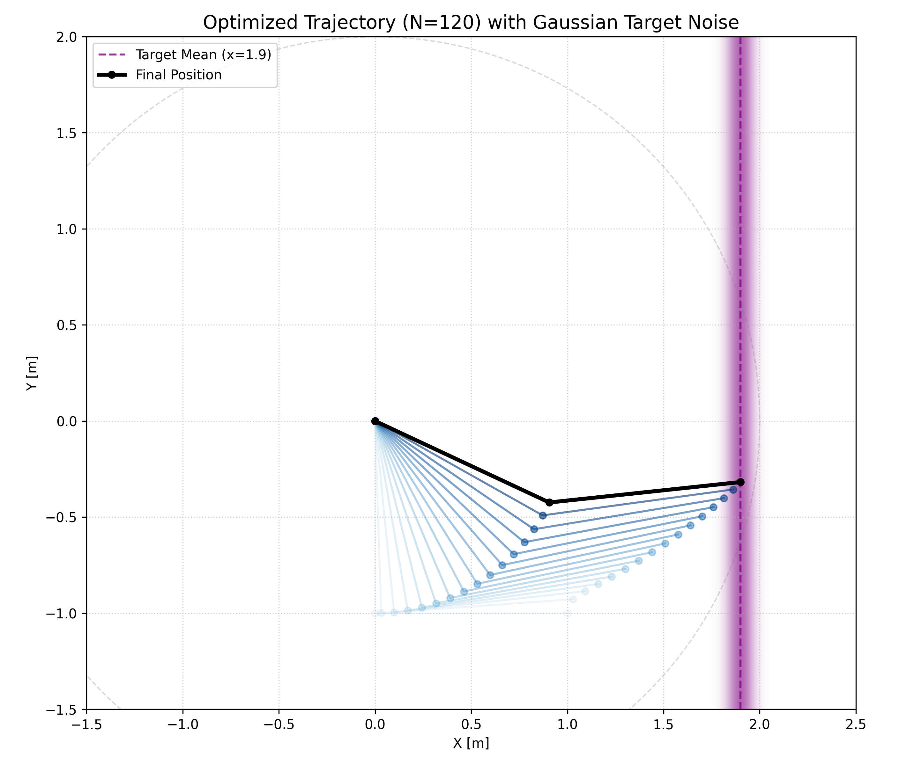

# DiffIRL: Inverse Reinforcement Learning with diffusion models

This project implements an Inverse Reinforcement Learning (IRL) approach using a **conditional diffusion model** to infer cost function weights from robot trajectories. It is applied to a 2-DOF robot arm, where the goal is to recover the weights of different cost terms (velocity, energy, torque, etc.) that generated a given optimal trajectory.

## Project Structure

- **`tools/`**: contains the core logic.
    - `OCP_solving_cpin.py`: solves the Optimal Control Problem (OCP) using CasADi and Pinocchio to generate ground truth data.
    - `diffusion_model.py`: defines the Neural Network architecture (transformer encoder + diffusion denoiser).
- **`scripts/`**: executable scripts for the workflow.
    - `generate_OCP_solutions.py`: generates a dataset of optimal trajectories and corresponding weights.
    - `train.py`: trains the diffusion model on the generated dataset.
    - `test.py`: tests the model on new trajectories and visualizes the predicted weight distributions.
- **`assets/`**: contains robot descriptions (URDF).
- **`data/`**: stores generated datasets (created by scripts).
- **`checkpoints/`**: stores trained models and scalers (created by scripts).

## Dependencies

The project relies on the following libraries:

- **python 3.x**
- **PyTorch**: deep learning framework (for the diffusion model).
- **CasADi**: for solving Optimal Control Problems (for the OCP solver).
- **Pinocchio**: for robot dynamics and kinematics (for the OCP solver).
- **NumPy, matplotlib**: for data manipulation and visualization (for plotting graphs).
- **scikit-learn**: for data scaling (`StandardScaler`, for the trajectories and weights).
- **Joblib**: for saving/loading scalers.
- **tqdm**: for progress bars.
- **FFmpeg**: for saving animations as MP4.

### Installation tutorial

The following section is describing the installation process, on a Linux machine, in order to make it work in a conda environment. For running on GPU, CUDA drivers must be installed properly before setting up the environment.

```bash
conda create -n DiffIRL python=3.10.17
conda activate DiffIRL
mamba install -c conda-forge pinocchio pinocchio-python eigenpy numpy matplotlib
pip install torch
```
<!-- pip install -e <acados_root>/interfaces/acados_template -->

## Usage Workflow

Before running any of the following commands, make sure to activate the conda environment.
```bash
conda activate DiffIRL
```

### 1. Data Generation
Generate a dataset of optimal trajectories by solving OCPs with random weights, from three noisy initial conditions, and to one noisy x-axis target.
```bash
python scripts/generate_OCP_solutions.py
```
*Output: `data/dataset_X_samples.pkl`*

<p align="center">
  
  
</p>

### 2. Training
Train the (conditional) diffusion model to predict weights from trajectories.
```bash
python scripts/train.py
```
*Input: `data/dataset_X_samples.pkl`*

*Output: Checkpoints `*.pth`, `scaler_w.pkl`, `scaler_traj.pkl` in folder `checkpoints/`*

### 3. Testing & Visualization
Test the model on unseen trajectories and visualize the probabilistic weight distribution.
```bash
python scripts/test.py
```
*Input: Checkpoints `*.pth`, `scaler_w.pkl`, `scaler_traj.pkl` in folder `checkpoints/`*

*Output: GIF/MP4 animations showing the trajectory and predicted weight distributions.*

## Method Overview

1.  **OCP Solver**: we assume the demonstrator optimizes a cost function composed of weighted terms (e.g., joint velocity, torque, energy). The weights change over 3 phases of the movement.
2.  **Diffusion Model**:
    -   **Encoder**: a transformer encodes the observed trajectory $(q, \dot{q})$ into a context vector.
    -   **Denoiser**: a conditional diffusion model, also transformer-based, takes the context and iteratively denoises random noise to approximate the posterior distribution of the weights $P(w | \tau)$, with $\tau = (q, \dot{q})$.

## Additional notes

1. If you're using WSL for a script that uses `matplotlib`, you might need to avoid showing the figures of matplotlib, by setting the backend to 'Agg' after importing matplotlib:

```python
import matplotlib
matplotlib.use('Agg')
```

2. Do not use WSL for generating trajectories as pinocchio is already difficult to set up on a regular Linux machine (trainings can be run on WSL, but not the trajectories generation).